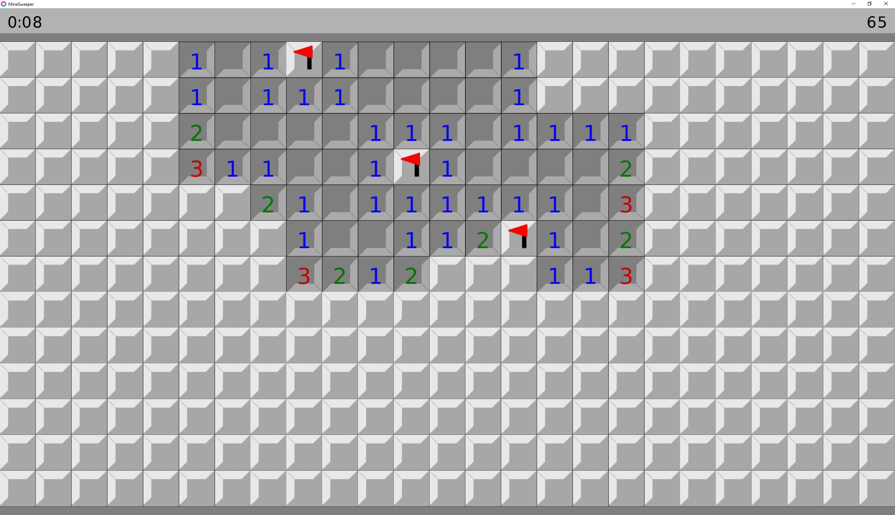

# love2d-MineSweeper-Game
simple, no frills minesweeper game to help me learn code

  
  
### Features:
- auto clearing empty sections
- flagging
- win/loss detection
- when clicking on a number with an adequate number of flags in it's area, it will clear all non-flagged boxes
- timer

# Installation
## Prerequisites
 - [LÖVE Game Engine](https://love2d.org/)

## Run/build
Extract the `MineSweeper.zip` into it's own folder and double-click `MineSweeper.exe` on windows

If you have LÖVE installed, you can simply download and run `MineSweeper.love` in Windows and Linux

for Mac OS X and more, please refer to [LÖVE's wiki instructions](https://love2d.org/wiki/Getting_Started)

# Usage
## controls:
  - uncover box: left-click
  - flag box: right-click
  - newgame/reset: middle-click
